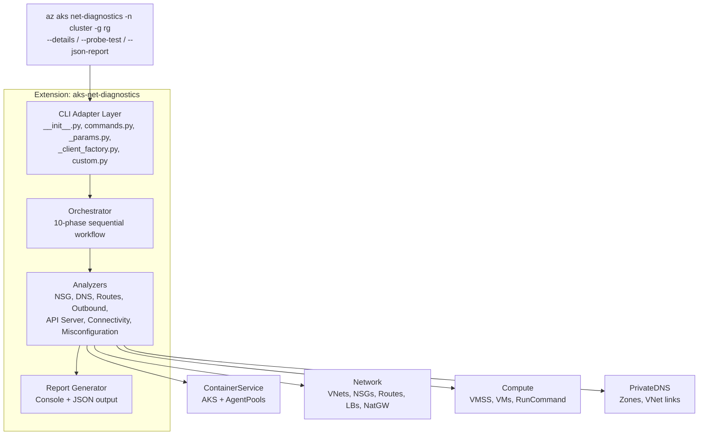
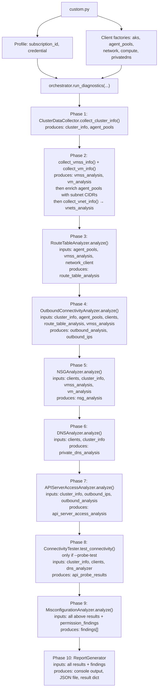
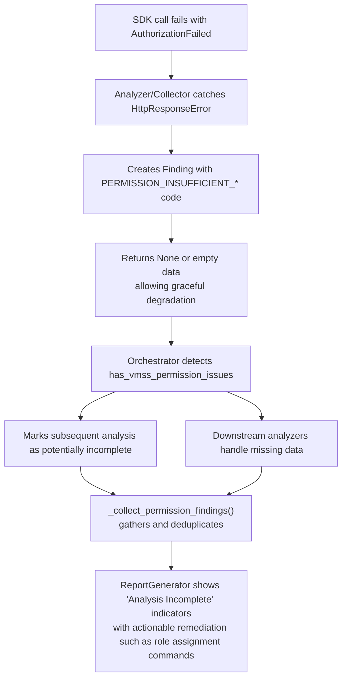
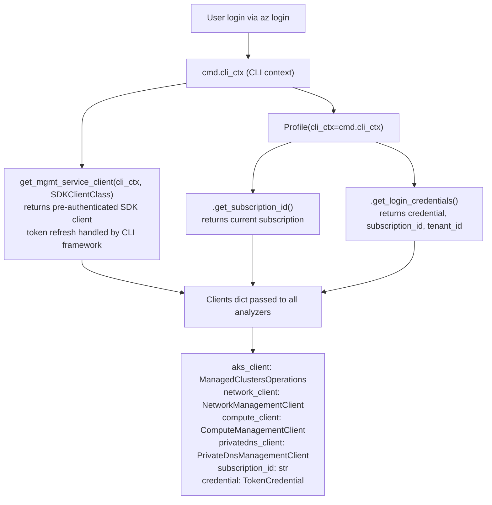

# AKS Net-Diagnostics Extension: Architecture

## Table of Contents

1. [Overview](#overview)
2. [POC Evolution](#poc-evolution)
3. [Architecture Overview](#architecture-overview)
4. [Extension Structure](#extension-structure)
5. [Integration Design](#integration-design)
6. [Module Breakdown](#module-breakdown)
7. [Data Flow](#data-flow)
8. [Authentication Architecture](#authentication-architecture)
9. [Design Decisions](#design-decisions)
10. [Code Quality Metrics](#code-quality-metrics)

## Overview

`aks-net-diagnostics` is an Azure CLI **extension** that provides comprehensive, read-only network diagnostics for AKS clusters. It is installed and updated independently of Azure CLI through `az extension add / az extension update`.

**Command:** `az aks net-diagnostics`

The diagnostic engine analyzes cluster networking configuration across multiple dimensions, including DNS, outbound connectivity, NSGs, routing, private DNS, and API server access. It correlates findings to surface misconfigurations with actionable remediation guidance.

## POC Evolution

This extension is the latest stage in an iterative proof-of-concept:

| Stage | Form Factor | Key Milestone |
|-------|-------------|---------------|
| 1 | Standalone Python script | Validated diagnostic concepts |
| 2 | Azure SDK integration (`aks-net-diagnostics` repo) | Proper Azure API patterns, `DefaultAzureCredential` |
| 3 | Azure CLI fork (subcommand under `az aks`) | CLI-native auth, 4 modified files in `acs` module |
| 4 | **Azure CLI extension** (current) | Self-contained package, independent release cycle |

### Why the Move to an Extension

Stage 3 embedded the diagnostic engine inside the `acs` command module of an `azure-cli` fork, requiring modifications to 4 existing files (`commands.py`, `_params.py`, `custom.py`, `_client_factory.py`). This worked for validation but had drawbacks:

- Tightly coupled to the azure-cli release cycle
- Required maintaining a fork with merge conflicts on every upstream sync
- Changes to existing files increased review and merge risk

The extension model (Stage 4) eliminates all of these: the diagnostic engine lives in its own package under `azure-cli-extensions`, modifies zero existing files, and can be versioned, tested, and released independently.

## Architecture Overview

### Design Philosophy

**Core Principles:**

1. **Read-Only Operation.** No Azure resources are created, modified, or deleted.
2. **CLI-Native Authentication.** Uses Azure CLI's credential system via `get_mgmt_service_client()`.
3. **Self-Contained Extension.** Zero modifications to Azure CLI core or other extensions.
4. **Graceful Degradation.** Missing permissions produce findings, not failures.
5. **Minimal Dependencies.** Only declares `azure-mgmt-network~=25.0` (not bundled with CLI 2.83+). All other SDK packages are bundled with the CLI itself.

### High-Level Architecture



## Extension Structure

```
src/aks-net-diagnostics/
├── setup.py                              # Package configuration, dependencies
├── README.md                             # Extension documentation
├── HISTORY.rst                           # Release history
├── azext_aks_net_diagnostics/
│   ├── __init__.py                       # AzCommandsLoader (extension entry point)
│   ├── _version.py                       # Version: 0.2.0b2
│   ├── _help.py                          # Help text definitions
│   ├── _params.py                        # CLI parameter definitions
│   ├── _client_factory.py                # Azure SDK client factories (5 clients)
│   ├── commands.py                       # Command registration
│   ├── custom.py                         # Command handler (bridge to engine)
│   ├── azext_metadata.json               # Extension metadata
│   │
│   │── # Diagnostic Engine ──────────────
│   ├── orchestrator.py                   # 10-phase diagnostic coordinator
│   ├── cluster_data_collector.py         # Azure data gathering (AKS, VMSS, VMs)
│   ├── nsg_analyzer.py                   # NSG rule validation
│   ├── dns_analyzer.py                   # DNS / private DNS configuration
│   ├── route_table_analyzer.py           # UDR impact analysis
│   ├── api_server_analyzer.py            # API server access security
│   ├── outbound_analyzer.py              # Outbound config (LB, NAT GW, UDR)
│   ├── connectivity_tester.py            # Active probe tests via VMSS RunCommand
│   ├── misconfiguration_analyzer.py      # Cross-component correlation
│   ├── report_generator.py              # Console + JSON report output
│   │
│   │── # Shared ─────────────────────────
│   ├── base_analyzer.py                  # Abstract base for analyzers
│   ├── models.py                         # Finding, FindingCode, Severity, etc.
│   ├── exceptions.py                     # Custom exception hierarchy
│   ├── validators.py                     # Input validation and sanitization
│   │
│   └── tests/                            # Test scaffolding
│       ├── __init__.py
│       └── latest/
│           ├── __init__.py
│           └── test_aks_net_diagnostics.py
```

**Total: 21 Python modules, ~8,500 lines of code**

## Integration Design

### Extension Entry Point (`__init__.py`)

Azure CLI discovers extensions through a `COMMAND_LOADER_CLS` class:

```python
class AksNetDiagnosticsCommandsLoader(AzCommandsLoader):
    def load_command_table(self, args):
        from azext_aks_net_diagnostics.commands import load_command_table
        load_command_table(self, args)
        return self.command_table

    def load_arguments(self, command):
        from azext_aks_net_diagnostics._params import load_arguments
        load_arguments(self, command)

COMMAND_LOADER_CLS = AksNetDiagnosticsCommandsLoader
```

### Command Registration (`commands.py`)

```python
with self.command_group('aks net-diagnostics', managed_clusters_sdk,
                        client_factory=cf_managed_clusters) as g:
    g.custom_command('', 'aks_net_diagnostics')
```

Registers `az aks net-diagnostics` as a custom command group with an empty subcommand name, so the command group itself is the executable command.

### Parameter Definitions (`_params.py`)

| Parameter | Short | Type | Description |
|-----------|-------|------|-------------|
| `--resource-group` | `-g` | string | Resource group name |
| `--name` | `-n` | string | AKS cluster name |
| `--details` | | flag | Show detailed diagnostic output |
| `--probe-test` | | flag | Run active connectivity tests from nodes |
| `--json-report` | | string | Path to write JSON report |

### Client Factories (`_client_factory.py`)

Five client factories create pre-authenticated SDK clients using `get_mgmt_service_client()`:

| Factory | SDK Client | Purpose |
|---------|-----------|---------|
| `cf_managed_clusters` | `ContainerServiceClient.managed_clusters` | Cluster info |
| `cf_agent_pools` | `ContainerServiceClient.agent_pools` | Agent pool details |
| `cf_network_client` | `NetworkManagementClient` | VNets, NSGs, routes, LBs, NAT GWs |
| `cf_compute_client` | `ComputeManagementClient` | VMSS, VMs, RunCommand |
| `cf_privatedns_client` | `PrivateDnsManagementClient` | Private DNS zones, VNet links |

All factories accept an optional `subscription_id` parameter for cross-subscription resource access.

### Command Handler (`custom.py`)

Bridges the Azure CLI framework to the diagnostic engine:

```python
def aks_net_diagnostics(cmd, client, resource_group_name, name,
                        details=False, probe_test=False, json_report=None):
    # Get subscription + credential from CLI context
    profile = Profile(cli_ctx=cmd.cli_ctx)
    subscription_id = profile.get_subscription_id()
    credential = profile.get_login_credentials()[0]

    # Create all required clients
    aks_client = client
    agent_pools_client = cf_agent_pools(cmd.cli_ctx)
    network_client = cf_network_client(cmd.cli_ctx)
    compute_client = cf_compute_client(cmd.cli_ctx)
    privatedns_client = cf_privatedns_client(cmd.cli_ctx)

    # Detect output format (suppress console for --output json/yaml/tsv)
    output_format = cmd.cli_ctx.invocation.data.get('output', 'table')
    suppress_console = output_format != 'table'

    # Delegate to orchestrator
    result = run_diagnostics(
        aks_client=aks_client, agent_pools_client=agent_pools_client,
        network_client=network_client, compute_client=compute_client,
        privatedns_client=privatedns_client, credential=credential,
        resource_group_name=resource_group_name, cluster_name=name,
        subscription_id=subscription_id, details=details,
        probe_test=probe_test, json_report_path=json_report,
        logger=logger, suppress_console_output=suppress_console
    )
    return result
```

## Module Breakdown

### Orchestrator (`orchestrator.py`, 614 lines)

Coordinates the 10-phase diagnostic workflow. Accepts pre-authenticated clients and parameters and returns a structured result dictionary.

**`run_diagnostics()` signature:**

```python
def run_diagnostics(
    aks_client, agent_pools_client, network_client, compute_client,
    privatedns_client, credential, resource_group_name, cluster_name,
    subscription_id, details=False, probe_test=False,
    json_report_path=None, logger=None, suppress_console_output=False
) -> Dict[str, Any]:
```

**10-Phase Flow:**

| Phase | Step | Module | Description |
|-------|------|--------|-------------|
| 1 | `[1/8]` | `ClusterDataCollector` | Cluster info + agent pools |
| 2 | `[2/8]` | `ClusterDataCollector` | VMSS/VM collection, VNet analysis, subnet enrichment |
| 3 | `[3/8]` | `RouteTableAnalyzer` | UDR impact on traffic flow |
| 4 | `[4/8]` | `OutboundConnectivityAnalyzer` | Outbound type, LB/NAT GW IPs |
| 5 | `[5/8]` | `NSGAnalyzer` | NSG rules, blocking detection |
| 6 | `[6/8]` | `DNSAnalyzer` | DNS servers, private DNS zones, VNet links |
| 7 | `[7/8]` | `APIServerAccessAnalyzer` | Authorized IP ranges, private endpoint |
| 8 | `[8/8]` | `ConnectivityTester` | Active DNS + HTTPS probes (optional) |
| 9 | | `MisconfigurationAnalyzer` | Cross-component correlation |
| 10 | | `ReportGenerator` | Console + JSON output |

Between phases the orchestrator enriches agent pool data with subnet CIDRs from actual VMSS/VM NICs (helper functions `_enrich_agent_pools_with_vmss_subnets`, `_enrich_agent_pools_with_vm_subnets`) and collects/deduplicates permission findings from all analyzers.

### ClusterDataCollector (`cluster_data_collector.py`, 530 lines)

Centralized Azure data gathering. Accepts individual SDK clients (AKS, AgentPools, Network, Compute).

**Key Methods:**

| Method | Data Source | Returns |
|--------|-----------|---------|
| `collect_cluster_info()` | AKS API | Cluster config, network profile, agent pools |
| `collect_vnet_info()` | Network API | VNet topology, subnets, peerings |
| `collect_vmss_info()` | Compute API | VMSS network profiles, instances |
| `collect_vm_info()` | Compute API | VM NICs (for VirtualMachines node pools) |

Handles authorization errors gracefully by storing permission findings rather than raising exceptions, so downstream analyzers can still run on available data.

### NSGAnalyzer (`nsg_analyzer.py`, 1,146 lines)

Inherits `BaseAnalyzer`. Validates NSGs attached to subnets and NICs used by the cluster.

**Analyzes:**
- Required AKS outbound rules (MCR, Azure Cloud, DNS, NTP)
- Inter-node communication rules
- Blocking rules and override detection
- Service tag semantics
- Azure CNI Overlay pod CIDR traffic rules

**Key Finding Codes:** `NSG_INTER_NODE_BLOCKED`, `NSG_BLOCKING_AKS_TRAFFIC`, `NSG_POTENTIAL_BLOCK`, `NSG_POD_CIDR_BLOCKED`, `NSG_POD_CIDR_PARTIAL`

### DNSAnalyzer (`dns_analyzer.py`, 438 lines)

Inherits `BaseAnalyzer`. Validates DNS configuration and private DNS zone linkage.

**Analyzes:**
- Azure default DNS vs custom DNS servers
- Private DNS zone configuration
- VNet links for private clusters (including cross-subscription BYO DNS zones)
- DNS server VNet hosting and reachability

**Key Finding Codes:** `PRIVATE_DNS_MISCONFIGURED`, `DNS_RESOLUTION_FAILED`

### RouteTableAnalyzer (`route_table_analyzer.py`, 419 lines)

Evaluates User Defined Routes associated with cluster subnets.

**Analyzes:**
- Default route (0.0.0.0/0) presence and next-hop type
- Routes to `VirtualAppliance` (firewall/NVA) or `VirtualNetworkGateway`
- Impact on AKS management and outbound traffic

**Key Finding Codes:** `UDR_CONFLICT`

### OutboundConnectivityAnalyzer (`outbound_analyzer.py`, 827 lines)

Determines effective outbound configuration and public IPs.

**Analyzes:**
- Outbound type: `loadBalancer`, `managedNATGateway`, `userAssignedNATGateway`, `userDefinedRouting`
- Load balancer frontend IPs and outbound rules
- NAT Gateway resources and public IPs (managed and user-assigned)
- UDR impact on outbound traffic path

**Key Finding Codes:** `PERMISSION_INSUFFICIENT_LB`

### APIServerAccessAnalyzer (`api_server_analyzer.py`, 519 lines)

Validates API server network access configuration.

**Analyzes:**
- Public vs private cluster setup
- VNet integration detection
- Authorized IP ranges, validating cluster outbound IPs are included
- UDR override detection, since a firewall or NVA may change the source IP

**Key Finding Codes:** `API_ACCESS_RESTRICTED`

### ConnectivityTester (`connectivity_tester.py`, 766 lines)

Active probe testing using VMSS RunCommand. Only runs when `--probe-test` is specified.

**Tests:**
- MCR DNS resolution (`mcr.microsoft.com`)
- Internet HTTPS connectivity (MCR pull endpoint)
- API server DNS resolution
- API server HTTPS connectivity

**Features:**
- Dependency-aware execution (skips HTTPS test if DNS fails)
- VMSS RunCommand execution with configurable timeouts
- Permission detection for RunCommand failures

**Key Finding Codes:** `PERMISSION_INSUFFICIENT_VMSS`

### MisconfigurationAnalyzer (`misconfiguration_analyzer.py`, 1,282 lines)

Cross-component correlation engine. Receives results from all other analyzers and detects composite issues.

**Analyzes:**
- Cluster provisioning failures
- Node pool failures
- Connectivity test result correlation
- NSG compliance
- DNS misconfiguration patterns
- Permission context (prevents false positives when data is incomplete)

**Key Finding Codes:** `CLUSTER_OPERATION_FAILURE`, `CLUSTER_STOPPED`

### ReportGenerator (`report_generator.py`, 1,375 lines)

Formats and outputs diagnostic results.

**Output Modes:**
- **Console summary** (default): markdown-formatted overview with findings
- **Console detailed** (`--details`): full network config, NSG rules, VNet topology
- **JSON export** (`--json-report`): structured data for automation
- **Structured output** (`--output json/yaml/tsv`): suppresses console, returns result dict to CLI framework

**Features:**
- Finding severity levels: CRITICAL, WARNING, INFO
- Network topology visualization
- NSG rule formatting
- Permission limitations section
- Subnet CIDR display for all node pool types

### Shared Modules

#### BaseAnalyzer (`base_analyzer.py`, 86 lines)

Abstract base class for `DNSAnalyzer` and `NSGAnalyzer`. Provides:
- Common `__init__` accepting `clients` dict and `cluster_info`
- `add_finding()` method with severity-aware logging
- `get_cluster_property()` for safe nested dict traversal

#### Models (`models.py`, 118 lines)

Data models and constants:
- `Severity` enum: CRITICAL, HIGH, WARNING, INFO
- `FindingCode` enum: 15 standardized finding codes
- `Finding` dataclass: severity, code, message, recommendation, details
- `VMSSInstance` dataclass: VMSS instance metadata for probe testing
- `DiagnosticResult` dataclass: container for all diagnostic output

#### Exceptions (`exceptions.py`, 37 lines)

Custom exception hierarchy rooted in `AKSDiagnosticsError`:
- `AzureSDKError`: API call failures (with error_code, status_code)
- `AzureAuthenticationError`: credential failures
- `ClusterNotFoundError`: cluster not found
- `InvalidConfigurationError`: invalid cluster config
- `ValidationError`: input validation failures

#### InputValidator (`validators.py`, 142 lines)

Input validation and sanitization:
- Cluster name / resource group name pattern matching
- Subscription ID (GUID format) validation
- Output file path validation (directory traversal prevention)

## Data Flow

### Phase Execution and Data Dependencies



### Permission Error Flow



## Authentication Architecture

### CLI Authentication Flow



The `credential` object is also passed directly for cross-subscription scenarios where analyzers need to create ad-hoc clients for resources in different subscriptions, such as BYO Private DNS zones in a hub subscription.

## Design Decisions

### 1. Extension vs. Core Module

**Decision:** Package as an Azure CLI extension, not a submodule of the `acs` command module.

**Rationale:**
- Independent versioning and release cycle
- No modifications to existing Azure CLI files (zero merge-conflict risk)
- Users install on demand: `az extension add --name aks-net-diagnostics`
- Easier to iterate during preview/beta phase

### 2. Explicit `azure-mgmt-network` Dependency

**Decision:** Declare `azure-mgmt-network~=25.0` as the only explicit dependency in `setup.py`.

**Rationale:**
- Azure CLI 2.83+ does **not** bundle `azure-mgmt-network` (the `az network` commands ship separately)
- Other required SDKs (`azure-mgmt-compute`, `azure-mgmt-containerservice`, `azure-mgmt-privatedns`) **are** bundled with the CLI
- Using compatible-release (`~=25.0`) pins the major version while allowing minor/patch updates

### 3. Output Format Awareness

**Decision:** Detect `--output json/yaml/tsv` and suppress console printing when a structured format is requested.

**Rationale:**
- The console report uses rich markdown formatting that would be garbled in `--output json`
- When `--output json` is specified, the CLI framework serializes the returned dict; the extension should not also print to stdout
- Default (`--output table` / no flag) shows the console report as before

### 4. Five Client Factories (vs. Three in Stage 3)

**Decision:** Create dedicated factories for `cf_managed_clusters`, `cf_agent_pools`, `cf_network_client`, `cf_compute_client`, and `cf_privatedns_client`.

**Rationale:**
- Stage 3 (azure-cli fork) reused existing factories from the `acs` module; only `cf_network_client` and `cf_compute_client` were added
- As a standalone extension we must create all factories ourselves
- `cf_privatedns_client` was implicitly available in Stage 3 through shared code; now it's explicit

### 5. Permission-Aware Graceful Degradation

**Decision:** Catch `AuthorizationFailed` errors, create diagnostic findings, and continue execution with reduced data.

**Rationale:**
- Enterprise users often have limited RBAC scopes
- Partial analysis is more useful than a crash
- Findings clearly communicate what was skipped and which roles to request
- Downstream analyzers handle `None` / empty data without false positives

### 6. Orchestrator-Driven Phase Architecture

**Decision:** Central `run_diagnostics()` function coordinates all phases sequentially, passing results forward.

**Rationale:**
- Clear execution order with explicit data dependencies
- Easy to add or reorder phases
- Permission checks from early phases inform later phases
- Single point of control for result aggregation and report generation

## Code Quality Metrics

### Implementation Stats

| Metric | Value |
|--------|-------|
| Python modules (excl. tests) | 21 |
| Total lines of code | ~8,500 |
| Diagnostic engine modules | 14 |
| CLI integration modules | 7 (`__init__`, `commands`, `_params`, `_client_factory`, `custom`, `_help`, `_version`) |
| Explicit dependencies | 1 (`azure-mgmt-network~=25.0`) |
| Finding codes | 15 |
| Azure SDK operations | 22 unique API calls |

### Module Size Breakdown

| Module | Lines | Role |
|--------|-------|------|
| `report_generator.py` | 1,375 | Report formatting |
| `misconfiguration_analyzer.py` | 1,282 | Cross-component correlation |
| `nsg_analyzer.py` | 1,146 | NSG validation |
| `outbound_analyzer.py` | 827 | Outbound analysis |
| `connectivity_tester.py` | 766 | Active probe tests |
| `orchestrator.py` | 614 | Phase coordination |
| `cluster_data_collector.py` | 530 | Data gathering |
| `api_server_analyzer.py` | 519 | API server access |
| `dns_analyzer.py` | 438 | DNS analysis |
| `route_table_analyzer.py` | 419 | UDR analysis |
| Other (7 modules) | ~624 | CLI integration + shared |

### Quality Checks

| Check | Status |
|-------|--------|
| `azdev linter` (22 rules) | PASSED, 0 violations |
| `azdev style` (pylint + flake8) | PASSED |
| `az aks net-diagnostics --help` | Loads correctly |
| `pip check` | No broken requirements |

---

**Version:** 0.2.0b2  
**Last Updated:** March 2026  
**Status:** Preview, active development
